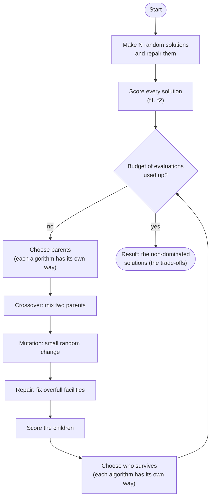
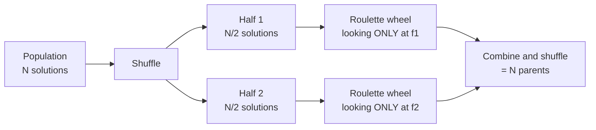
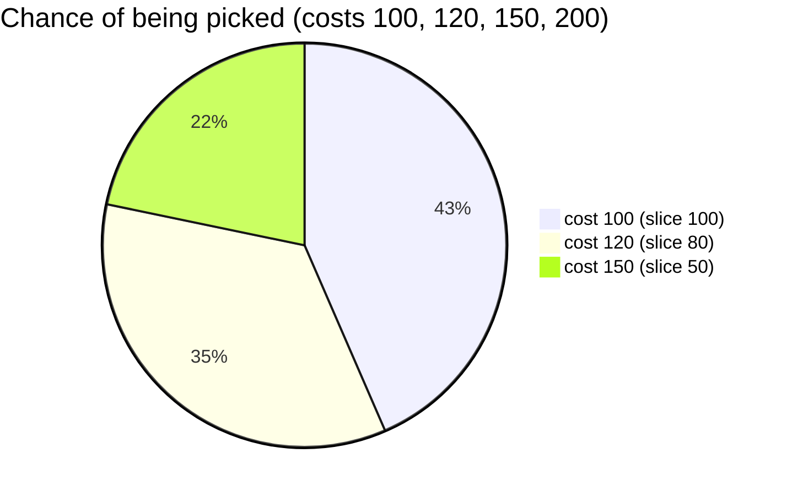
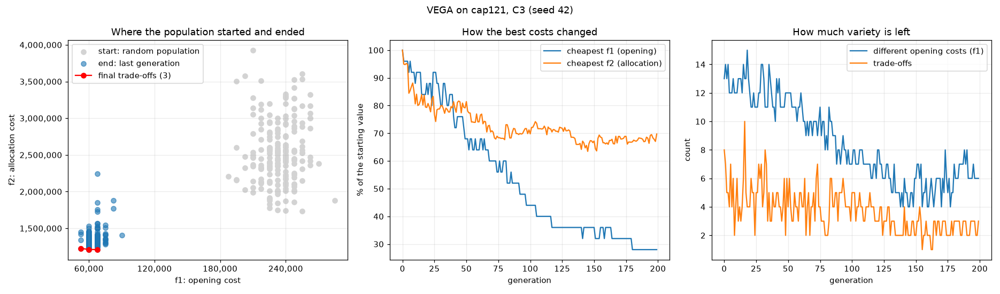

# acit-4610-ma-2-group-7

ACIT4610's Mandatory Assignment 2 - Group 7: the **multi-objective Capacitated Facility Location Problem (CFLP)**
solved with the evolutionary algorithm **VEGA**.

---

## 1. How to run

### 1.1 Installation

You need **Python 3.10 or newer** (tested with 3.12 and 3.14).

```bash
git clone https://github.com/Mughil97/acit-4610-ma-2-group-7.git
cd acit-4610-ma-2-group-7
python3 -m venv .venv
source .venv/bin/activate          # Windows: .venv\Scripts\activate
pip install -r requirements.txt    # only matplotlib, for plots
```

### 1.2 How to run VEGA

One run of VEGA on cap121 with configuration C1:

```bash
python run_experiments.py --algorithms vega --instances cap121 --configs C1 --runs 1
```

Expected output:

```text
vega   cap121  C1  seed 42:  2 trade-offs,  best f1    52,500,  best f2    1,380,867,  0.24 s

saved 2 front points to .../results/fronts.csv
saved 1 plot (the first run of each combination) to .../results/plots
```

A window with the plot of the run opens at the end, like in the lab (see 2.2.2 for how to read it).

The options:

| Option | Meaning | Default |
|---|---|---|
| `--algorithms` | `vega` | `vega` |
| `--instances` | any of `cap61 cap62 cap101 cap102 cap121 cap122` | all six |
| `--configs` | any of `C1 C2 C3` (see the settings in 2.1) | all three |
| `--runs` | independent runs per combination; run 1 uses seed 42, run 2 seed 43, ... | 10 |

**Run the entire thing** (VEGA on all six instances, C1 to C3, 10 seeds each: 180 runs, about a minute):

```bash
python run_experiments.py
```

It saves:

- `results/fronts.csv`: every point of every final front (columns: algorithm, instance, config, seed, seconds, f1, f2);
- `results/plots/`: one picture per instance and config, of its first run (seed 42), e.g. `vega_cap121_C3.png`.

Windows only open when a run makes 3 plots or fewer; otherwise open the pictures in `results/plots/`.
The same seed always gives the same result.

The notebook [experiment/vega.ipynb](experiment/vega.ipynb) builds VEGA cell by cell, with a small demo and plots
after each step. To open it: `pip install ipykernel`, open the notebook in VS Code, choose the `.venv` kernel and
click **Run All**.

---

## 2. Algorithms

### 2.1 Implementation

This part outlines the implementation details. The assignment requires the evolutionary algorithm to use a specific solution format, repair,
crossover, mutation and settings.

#### The problem

A company has some customers and some places where it could open a warehouse (a **facility**).
It must decide **which facility serves each customer**. Two costs matter:

- **f1, the opening cost:** the fixed costs of all open facilities, added up;
- **f2, the allocation cost:** the cost of serving each customer from its facility, added up.

Both should be as **small** as possible, but they fight each other: few facilities make f1 low but f2 high
(customers are far away), and many facilities do the opposite. So there is no single best answer, only a set of
good **trade-offs**.

Every solution must follow three rules:

1. each customer is served by **exactly one** facility;
2. only an **open** facility can serve customers;
3. a facility can not serve more demand than its **capacity**.

The data comes unchanged from J. E. Beasley's [OR-Library](https://people.brunel.ac.uk/~mastjjb/jeb/orlib/capinfo.html)
(see [data/README.md](data/README.md)): cap61 and cap62 (16 facilities), cap101 and cap102 (25), cap121 and cap122 (50),
each with 50 customers.

**The tiny example used below:** 3 facilities (0, 1, 2), each with capacity 100, and 4 customers (0, 1, 2, 3):

| | Customer 0 | Customer 1 | Customer 2 | Customer 3 | Fixed cost |
|---|---|---|---|---|---|
| **Demand** | 60 | 50 | 40 | 30 | |
| Serving cost from facility 0 | 10 | 20 | 30 | 40 | 100 |
| Serving cost from facility 1 | 30 | 10 | 20 | 30 | 80 |
| Serving cost from facility 2 | 40 | 30 | 10 | 10 | 120 |

#### The big idea: evolution

An evolutionary algorithm copies natural selection: start with a **population** of random solutions, score them,
let the better ones become **parents** of **children** that mix them with small random changes, and repeat.
Generation after generation, the population gets better.



#### A. How a solution is stored

A solution (an **individual**) is a list with **one number per customer: the facility that serves it**.

```text
[0, 1, 1, 0]   customer 0 -> facility 0,  customer 1 -> facility 1,
               customer 2 -> facility 1,  customer 3 -> facility 0
               facilities 0 and 1 are open, facility 2 is closed
```

This automatically follows rules 1 and 2. Only rule 3 (capacity) can still break.

#### B. A random start, then repair

Every customer gets a random facility. That can overload a facility, so the solution is **repaired**: while a facility
is over capacity, its customers are moved one at a time (in random order) to a random facility that still has room.

```text
before: [0, 0, 0, 1]   facility 0 carries 60 + 50 + 40 = 150, but holds only 100
move customer 1 (demand 50) to a facility with room, say facility 2
after:  [0, 2, 0, 1]   loads: facility 0 = 100, facility 1 = 30, facility 2 = 50   -> all fit
```

#### C. Scoring a solution

```text
[0, 2, 0, 1]   open facilities: 0, 1, 2
f1 = 100 + 80 + 120           = 300
f2 = 10 + 30 + 30 + 30        = 100   (each customer's cost from its own facility)
```

Scores are only calculated **after** repair. Each scored solution counts as one **evaluation**.

#### D. Comparing solutions: dominance and the Pareto front

Solution A **dominates** B when A is **not worse in any score** and **strictly better in at least one**.

| Solution | f1 | f2 | |
|---|---|---|---|
| P = `[0, 1, 1, 0]` | 180 | 80 | 2 facilities open |
| Q = `[0, 1, 2, 2]` | 300 | 40 | 3 facilities open |
| R = `[0, 2, 0, 1]` | 300 | 100 | 3 facilities open |

Q dominates R (same f1, lower f2). P and Q are different trade-offs: neither dominates the other.
The solutions nobody dominates form the **Pareto front**, here P and Q:

```text
 f2 (allocation cost)
 100 |            R   <- dominated by Q
  80 |  P
  60 |
  40 |            Q
     +----------------- f1 (opening cost)
       180       300
```

#### E. Making children: crossover, mutation, repair

Parents are taken two at a time, and each pair makes two children.

**Crossover** (probability p_c): cut both parents at the same random place and swap the tails.
Without crossover the children are copies of the parents.

```text
parent A = [0, 1 | 1, 0]        child 1 = [0, 1 | 2, 1]
parent B = [2, 0 | 2, 1]   ->   child 2 = [2, 0 | 1, 0]
```

**Mutation:** each customer, with a small probability p_m, moves to **another facility that is already open**.
If it was the last customer there, that facility closes and f1 goes down:

```text
child 1 = [0, 1, 2, 1]   f1 = 300, f2 = 60
customer 2 moves from facility 2 to facility 0
result  = [0, 1, 0, 1]   f1 = 180, f2 = 80   (facility 2 has no customers left, so it closes)
```

**Repair:** every child is repaired (B) before it is scored.

#### F. Stopping and the result

The loop stops when the **evaluation budget** is used up. With C1 (N = 50, 10,000 evaluations) the first population
costs 50 evaluations and every generation another 50, so there are (10,000 - 50) / 50 = **199 generations**.
The result is the Pareto front of the last generation, without duplicates, sorted by f1.

#### Settings

The settings live in [app/config.py](app/config.py):

| Config | Population N | Evaluations | Crossover p_c | Mutation p_m |
|---|---|---|---|---|
| C1 | 50 | 10,000 | 0.9 | 0.05 |
| C2 | 100 | 20,000 | 0.9 | 0.02 |
| C3 | 200 | 40,000 | 0.8 | 0.01 |

Every random choice uses one random generator started from a **seed** (42), so the same seed always repeats a run
exactly. The assignment asks for 10 runs (10 seeds) per instance and configuration.

#### Where each part is in the code

| Part | File | Function |
|---|---|---|
| A. how a solution is stored | [app/problem/representation.py](app/problem/representation.py) | `random_individual` |
| B. repair | [app/problem/repair.py](app/problem/repair.py) | `repair` |
| C. scoring | [app/problem/evaluation.py](app/problem/evaluation.py) | `evaluate` |
| D. dominance, Pareto front | [app/utils/pareto.py](app/utils/pareto.py) | `dominates`, `non_dominated` |
| E. crossover, mutation | [app/algorithms/operators.py](app/algorithms/operators.py) | `crossover`, `mutate` |
| F. the loop and the result | [app/algorithms/base.py](app/algorithms/base.py) | `MOEA.run` |

### 2.2 VEGA

VEGA (Vector Evaluated Genetic Algorithm, Schaffer 1984) is the first real multi-objective evolutionary algorithm
(Lecture 3, slides 33-35). It is a normal genetic algorithm with one change: **how parents are chosen**.
Code: [app/algorithms/vega.py](app/algorithms/vega.py).

#### 2.2.1 VEGA Algorithm

**Choosing parents.** VEGA judges each half of the population by **only one** score:



1. **Shuffle** the population so the split is random.
2. **Split** it into two equal halves (q = N / 2).
3. Half 1 picks N/2 parents looking **only at f1**; half 2 picks N/2 parents looking **only at f2**.
4. **Combine and shuffle** the parents, so a parent that is cheap to open can pair with one that is cheap to serve.

**The roulette wheel.** Every solution in a half gets a slice of a wheel, and a bigger slice means a bigger chance
of being picked. We want small costs, so:

```text
slice = (worst cost in the half) - (my cost)
```

The best solution gets the biggest slice and the worst gets none (Lecture 3, slide 39). With costs 100, 120, 150
and 200, the slices are 100, 80, 50 and 0:



The cost-200 solution has slice 0, so it is never picked. To **spin**, draw a random number between 0 and the total
of all slices (230 here) and see whose slice it lands in. Spin once for every parent needed.

> **Why not the lab's formula?** Lab 3 uses slice = 1 / (1 + cost). That works for its costs between 0 and 16,
> but CFLP costs are around a million. For costs 1.0M, 1.1M and 1.2M it gives chances of 36.5%, 33.1% and 30.4%,
> which is almost random. `worst - cost` gives 66.7%, 33.3% and 0%.

**Who survives.** VEGA uses **generational replacement**: the N children replace **all** N parents.

**The whole of VEGA in pseudo-code:**

```text
population = N random solutions, each repaired
scores     = (f1, f2) of every solution

while evaluations < budget:
    shuffle the population and split it into two halves
    parents  = roulette(half 1, on f1) + roulette(half 2, on f2), shuffled
    children = []
    for each pair of parents:
        child1, child2 = crossover(pair)       # probability p_c
        mutate each child                      # probability p_m per customer
        repair each child
        add them to children
    scores     = (f1, f2) of every child
    population = children                      # generational replacement

return the non-dominated scores
```

#### 2.2.2 VEGA Result

One run per configuration with seed 42, on one small, one medium and one large instance:

| Instance | Config | Trade-offs found | Pareto front (f1, f2) | Time |
|---|---|---|---|---|
| cap61 | C1 | 3 | (52,500, 1,402,757), (60,000, 1,351,098), (67,500, 1,331,653) | 0.14 s |
| cap61 | C2 | 2 | (52,500, 1,327,786), (60,000, 1,201,305) | 0.25 s |
| cap61 | C3 | 3 | (45,000, 1,265,071), (52,500, 1,250,551), (60,000, 1,217,828) | 0.49 s |
| cap101 | C1 | 1 | (30,000, 1,153,560) | 0.17 s |
| cap101 | C2 | 1 | (37,500, 1,100,450) | 0.29 s |
| cap101 | C3 | 1 | (45,000, 1,144,740) | 0.59 s |
| cap121 | C1 | 2 | (52,500, 1,469,533), (67,500, 1,380,867) | 0.24 s |
| cap121 | C2 | 2 | (52,500, 1,555,781), (60,000, 1,262,842) | 0.44 s |
| cap121 | C3 | 3 | (52,500, 1,225,511), (60,000, 1,212,651), (67,500, 1,209,356) | 0.87 s |

Every solution VEGA scored follows all three rules, and running the same seed again gives exactly the same numbers.
The table shows seed 42 only. `python run_experiments.py` runs all 10 seeds and saves every front
in `results/fronts.csv`. The hypervolume metric is not written yet.

**One run in pictures** (cap121, C3, seed 42, from `results/plots/vega_cap121_C3.png`):



- **Left, where the population started and ended:** grey is the random start, blue the last generation, red the
  final trade-offs. The population moved from expensive (right) to cheap (bottom left), but ended in one small area.
- **Middle, how the best costs changed:** the cheapest opening cost falls to about 28% of the start. The cheapest
  allocation cost only falls to about 70% and goes up and down, because the children replace all the parents,
  so the best solutions of a generation can be lost.
- **Right, how much variety is left:** the number of different opening costs (how many different facility counts
  the population still tries) drops from 13 to about 6, and only 2 to 3 trade-offs remain. On cap101 with C1 it drops
  to a single opening cost and a single trade-off. This loss of variety is VEGA's known weakness.

**Small instances:** the assignment lists cap41 and cap42, but there every facility holds 5,000 while two customers
need more than that (12,912 and 5,495). With exactly one facility per customer they can not be placed anywhere, so
the group uses cap61 and cap62 instead: the same customers and costs, with 15,000 per facility.
If cap41 or cap42 is loaded, the code stops with a clear message.

#### 2.2.3 VEGA Verdict

**What works:**

- every solution follows all three rules, and runs can be repeated exactly with the same seed;
- it is fast (under a second per run) and simple: only the parent choice differs from a plain genetic algorithm.

**What does not work well:**

- it finds only **1 to 3 trade-offs**, all close together. On cap121, f1 could range from 22,500 (the fewest
  facilities that can hold all the demand) to 367,500 (every facility open), but VEGA only covers 52,500 to 67,500;
- this is VEGA's known weakness (Lecture 3, slide 43): each solution is judged by one score at a time, and all
  the children replace the parents, so good solutions get lost and the population loses variety.

**Effect of the configurations (one seed, so only a first impression):** on cap121, a bigger population and budget
(C1 to C3) steadily lowered the best f2 (1,380,867 to 1,209,356) and found one more trade-off, while the run time
roughly doubled with each step. On cap101 there was no clear improvement. The 10-seed runs will show whether these
differences are real.


---


