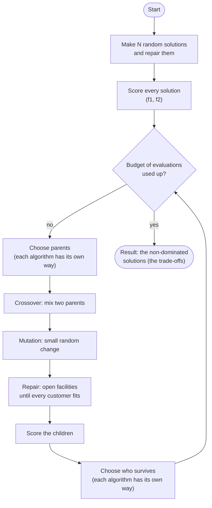
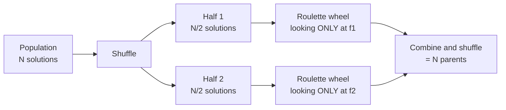
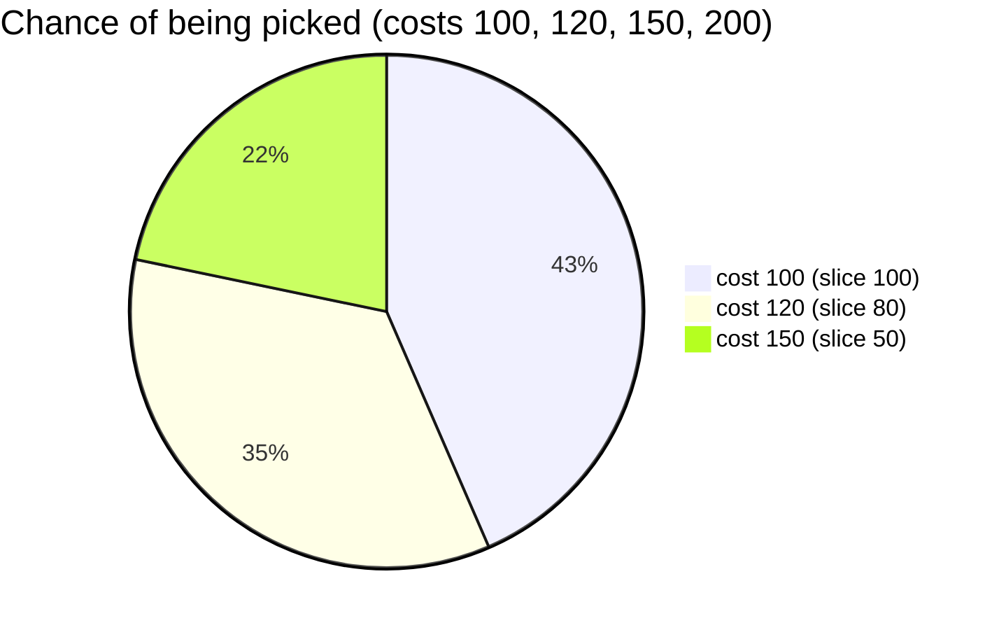
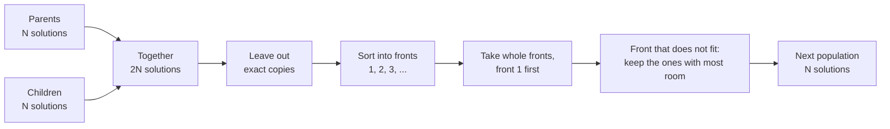
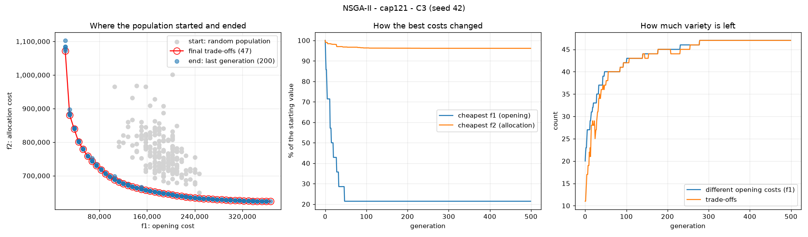
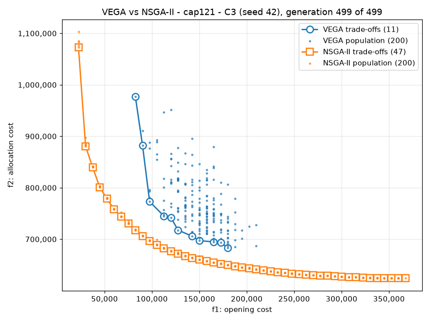

# acit-4610-ma-2-group-7

ACIT4610's Mandatory Assignment 2 - Group 7: the **multi-objective Capacitated Facility Location Problem (CFLP)**
solved with two evolutionary algorithms, **VEGA** and **NSGA-II**.

---

## 1. How to run

### 1.1 Installation

You need **Python 3.10 or newer** (tested with 3.12 and 3.14).

```bash
git clone https://github.com/Mughil97/acit-4610-ma-2-group-7.git
cd acit-4610-ma-2-group-7
python3 -m venv .venv
source .venv/bin/activate          # Windows: .venv\Scripts\activate
pip install -r requirements.txt    # only matplotlib, for plots
```

### 1.2 How to run the experiments

**Run the entire thing** (VEGA and NSGA-II on all six instances, C1 to C3, 10 seeds each: 360 runs, about 5
minutes). A window plays the first run (seed 42) of every instance and configuration, both algorithms on one plot:

```bash
python run_experiments.py
```

One run of each algorithm on cap121 with configuration C3:

```bash
python run_experiments.py --instances cap121 --configs C3 --runs 1
```

The options:

| Option             | Meaning                                                                  | Default   |
| ------------------ | ------------------------------------------------------------------------ | --------- |
| `--algorithms`     | any of `vega nsga2`                                                      | both      |
| `--instances`      | any of `cap61 cap62 cap101 cap102 cap121 cap122`                         | all six   |
| `--configs`        | any of `C1 C2 C3` (see the settings in 2.1)                              | all three |
| `--runs`           | independent runs per combination; run 1 uses seed 42, run 2 seed 43, ... | 10        |
| `--representation` | `binary` (Sofia's design) or `integer` (see the end of 2.1)              | `binary`  |

What a run saves (an integer run saves the same files in `results/integer/`):

- `results/fronts.csv`: every point of every final front (columns: algorithm, instance, config, seed, seconds, f1, f2);
- `results/summary.csv`: the hypervolume table (see 3.2);
- `results/plots/`: for every instance and config, one picture per algorithm of its first run (seed 42), e.g.
  `vega_cap121_C3.png` (see 2.2.2), and both final fronts together, e.g. `compare_cap121_C3.png` (see 3.2).

Every run rewrites these files with only what it ran, so run the full `python run_experiments.py` again to get all
the results back.

---

## 2. Algorithms

### 2.1 Implementation

This part outlines the implementation details. The assignment lets every group design its own solution format, but
both algorithms must use the same format, repair, crossover, mutation and settings. We use Sofia's binary design by
default; the earlier integer design can still be chosen with `--representation integer` (see the end of 2.1).

#### The problem

A company has some customers and some places where it could open a warehouse (a **facility**).
It must decide **which facilities to open** and **which open facility serves each customer**. Two costs matter:

- **f1, the opening cost:** the fixed costs of all open facilities, added up;
- **f2, the allocation cost:** the cost of serving each customer from its facility, added up.

Both should be as **small** as possible, but they fight each other: few facilities make f1 low but f2 high
(customers are far away), and many facilities do the opposite. So there is no single best answer, only a set of
good **trade-offs**.

Every solution must follow three rules:

1. each customer is served by **exactly one** facility;
2. only an **open** facility can serve customers;
3. a facility can not serve more demand than its **capacity**.

The data comes unchanged from J. E. Beasley's [OR-Library](https://people.brunel.ac.uk/~mastjjb/jeb/orlib/capinfo.html)
(see [data/README.md](../data/README.md)): cap61 and cap62 (16 facilities), cap101 and cap102 (25), cap121 and cap122
(50), each with 50 customers.

**The tiny example used below:** 3 facilities (0, 1, 2), each with capacity 100, and 4 customers (0, 1, 2, 3):

|                              | Customer 0 | Customer 1 | Customer 2 | Customer 3 | Fixed cost |
| ---------------------------- | ---------- | ---------- | ---------- | ---------- | ---------- |
| **Demand**                   | 60         | 50         | 40         | 30         |            |
| Serving cost from facility 0 | 10         | 20         | 30         | 40         | 100        |
| Serving cost from facility 1 | 30         | 10         | 20         | 30         | 80         |
| Serving cost from facility 2 | 40         | 30         | 10         | 10         | 120        |

#### The big idea: evolution

An evolutionary algorithm copies natural selection: start with a **population** of random solutions, score them,
let the better ones become **parents** of **children** that mix them with small random changes, and repeat.
Generation after generation, the population gets better.



#### A. How a solution is stored

A solution (an **individual**) is a list with **one 0 or 1 per facility**: 1 means the facility is open.

```text
[1, 1, 0]   facilities 0 and 1 are open, facility 2 is closed
```

The list only says which facilities are open. Which facility serves which customer is worked out by a fixed rule,
the **greedy decoder** (C), so every customer always gets exactly one open facility (rules 1 and 2).

#### B. A random start, then repair

Every facility is opened with probability 0.5. The open facilities may not have room for all the customers, so the
solution is **repaired**: while the open capacity is less than the total demand, one more facility is opened
(a free one, with fixed cost 0, if there is one, otherwise a random closed one).

```text
before: [0, 0, 1]   open capacity 100, but the customers need 60 + 50 + 40 + 30 = 180
open a random closed facility, say facility 0
after:  [1, 0, 1]   open capacity 200   -> enough
```

If there is enough capacity in total but the decoder still finds no room for some customer (the room is split
badly), one more facility is opened, until every customer fits (rule 3).

#### C. The greedy decoder and scoring

The decoder serves the **biggest customers first** (they are the hardest to fit), each by the **cheapest open
facility that still has room**:

```text
[1, 1, 0]                 facilities 0 and 1 are open, capacity 100 each
customer 0 (demand 60):   cheapest open is facility 0 (cost 10)                -> facility 0, load 60
customer 1 (demand 50):   cheapest open is facility 1 (cost 10)                -> facility 1, load 50
customer 2 (demand 40):   cheapest open is facility 1 (cost 20)                -> facility 1, load 90
customer 3 (demand 30):   facility 1 (cost 30) has no room left (90 + 30 > 100),
                          so the next cheapest open, facility 0 (cost 40)      -> facility 0, load 90
customers -> facilities:  [0, 1, 1, 0]
f1 = 100 + 80             = 180
f2 = 10 + 10 + 20 + 40    = 80   (each customer's cost from its own facility)
```

Scores are only calculated **after** repair and decoding, so every scored solution follows all three rules.
Each scored solution counts as one **evaluation**.

#### D. Comparing solutions: dominance and the Pareto front

Solution A **dominates** B when A is **not worse in any score** and **strictly better in at least one**.

| Solution        | Customers -> facilities | f1  | f2  |                   |
| --------------- | ----------------------- | --- | --- | ----------------- |
| P = `[1, 1, 0]` | `[0, 1, 1, 0]`          | 180 | 80  | 2 facilities open |
| Q = `[1, 1, 1]` | `[0, 1, 2, 2]`          | 300 | 40  | 3 facilities open |
| R = `[0, 1, 1]` | `[1, 2, 2, 1]`          | 200 | 100 | 2 facilities open |

P dominates R (lower f1 and lower f2). P and Q are different trade-offs: neither dominates the other.
The solutions nobody dominates form the **Pareto front**, here P and Q:

```text
 f2 (allocation cost)
 100 |     R                        <- dominated by P
  80 | P
  60 |
  40 |                         Q
     +----------------------------- f1 (opening cost)
      180 200                 300
```

#### E. Making children: crossover, mutation, repair

Parents are taken two at a time, and each pair makes two children.

**Crossover** (probability p_c): **uniform crossover**. For every facility a coin flip decides which parent each
child copies. Without crossover the children are copies of the parents.

```text
parent A = [1, 1, 0]     coin flips: keep, swap, keep
parent B = [0, 0, 1]
child 1  = [1, 0, 0]     facility 1 comes from B
child 2  = [0, 1, 1]     facility 1 comes from A
```

**Mutation:** every facility **flips** (open becomes closed, closed becomes open) with a small probability, so that
on average 1 or 2 facilities flip per child (see the settings):

```text
child 1 = [1, 0, 0]   open capacity 100, too little
facility 2 flips
result  = [1, 0, 1]   f1 = 220, f2 = 90
```

**Repair:** every child is repaired (B) before it is decoded and scored (C).

#### F. Stopping and the result

The loop stops when the **evaluation budget** is used up. With C1 (N = 50, 10,000 evaluations) the first population
costs 50 evaluations and every generation another 50, so there are (10,000 - 50) / 50 = **199 generations**
(C2: 299, C3: 499). The result is the Pareto front of the last generation, without duplicates, sorted by f1.

#### Settings

The settings live in [app/config.py](config.py). They are Sofia's settings P1, P2 and P3:

| Config | Population N | Evaluations | Crossover p_c | Mutation: genes changed per child |
| ------ | ------------ | ----------- | ------------- | --------------------------------- |
| C1     | 50           | 10,000      | 0.8           | 1                                 |
| C2     | 100          | 30,000      | 0.9           | 1                                 |
| C3     | 200          | 100,000     | 0.95          | 2                                 |

Each gene changes with probability (genes changed per child) / (number of genes). In the binary design a gene is a
facility, so on cap121 with C1 each facility flips with probability 1 / 50 = 2%.
Every random choice uses one random generator started from a **seed** (42), so the same seed always repeats a run
exactly. The assignment asks for 10 runs (10 seeds) per instance and configuration.

#### The integer design (`--representation integer`)

Before the switch to Sofia's design, a solution was stored as **one facility per customer**: `[0, 1, 1, 0]` means
customer 0 -> facility 0, customers 1 and 2 -> facility 1, customer 3 -> facility 0 (so facility 2 is closed). It can
still be chosen with `python run_experiments.py --representation integer`; its results go to `results/integer/`.
Only the parts below change, VEGA and NSGA-II stay the same:

- **random start:** every customer picks a random facility;
- **repair:** customers are moved off overfull facilities, in random order, to random facilities with room;
- **scoring:** no decoder is needed; a facility is open when it serves a customer;
- **crossover:** one-point (cut both parents at the same random place and swap the tails);
- **mutation:** a customer moves to another facility that is already open (a gene is a customer here, so on
  average 1 or 2 customers move per child).

**Integer against binary** (same settings and seeds, 10 runs each; the integer results are in `results/integer/`):

| Instance | Config | Trade-offs, integer (VEGA / NSGA-II) | Trade-offs, binary (VEGA / NSGA-II) | Lowest f2 found by NSGA-II, integer / binary |
| -------- | ------ | ------------------------------------ | ----------------------------------- | -------------------------------------------- |
| cap61    | C1     | 1.2 / 4.1                            | 6.1 / 13.0                          | 872,394 / 837,970                            |
| cap61    | C2     | 1.6 / 5.4                            | 6.6 / 13.0                          | 849,640 / 837,970                            |
| cap61    | C3     | 2.5 / 7.3                            | 7.8 / 13.0                          | 838,472 / 837,970                            |
| cap101   | C1     | 1.1 / 4.8                            | 8.0 / 24.9                          | 768,273 / 652,291                            |
| cap101   | C2     | 1.0 / 6.2                            | 9.5 / 25.0                          | 739,387 / 652,291                            |
| cap101   | C3     | 1.0 / 9.9                            | 10.4 / 25.0                         | 711,409 / 652,291                            |
| cap121   | C1     | 1.6 / 4.6                            | 8.1 / 39.6                          | 764,183 / 625,106                            |
| cap121   | C2     | 2.0 / 7.2                            | 8.6 / 43.8                          | 756,754 / 624,071                            |
| cap121   | C3     | 3.3 / 10.0                           | 9.2 / 45.5                          | 706,708 / 624,071                            |

With the integer design both algorithms find far fewer trade-offs and a higher allocation cost: evolution has to find
every customer's facility itself, while in the binary design it only chooses which facilities are open and the
decoder serves the customers. NSGA-II still beats VEGA there, with a higher mean hypervolume in every combination
(`results/integer/summary.csv`). Each `summary.csv` is scaled on its own runs, so compare hypervolumes only within one
file.

#### Where each part is in the code

The binary function comes first, the integer one in brackets.

| Part                        | File                                                                                           | Function                                                                |
| --------------------------- | ---------------------------------------------------------------------------------------------- | ----------------------------------------------------------------------- |
| A. how a solution is stored | [app/problem/representation.py](problem/representation.py)                                     | `random_binary` (`random_integer`)                                      |
| B. repair                   | [app/problem/repair.py](problem/repair.py)                                                     | `repair_binary`, `open_one` (`repair_integer`)                          |
| C. greedy decoder, scoring  | [app/problem/repair.py](problem/repair.py), [app/problem/evaluation.py](problem/evaluation.py) | `decode`, `evaluate_binary` (`evaluate_integer`)                        |
| D. dominance, Pareto front  | [app/utils/pareto.py](utils/pareto.py)                                                         | `dominates`, `non_dominated`                                            |
| E. crossover, mutation      | [app/algorithms/operators.py](algorithms/operators.py)                                         | `uniform_crossover`, `bit_flip` (`one_point_crossover`, `move_to_open`) |
| F. the loop and the result  | [app/algorithms/base.py](algorithms/base.py)                                                   | `MOEA.run`; `REPRESENTATIONS` picks the functions above                 |

The decoder's two fixed orders (customers by demand, facilities by cost) are worked out once per instance in
[app/problem/loader.py](problem/loader.py) (`customers_by_demand`, `facilities_by_cost`).

### 2.2 VEGA

VEGA (Vector Evaluated Genetic Algorithm, Schaffer 1984) is the first real multi-objective evolutionary algorithm
(Lecture 3, slides 33-35). It is a normal genetic algorithm with one change: **how parents are chosen**.
Code: [app/algorithms/vega.py](algorithms/vega.py).

#### 2.2.1 VEGA Algorithm

**Choosing parents.** VEGA judges each half of the population by **only one** score:



1. **Shuffle** the population so the split is random.
2. **Split** it into two equal halves (q = N / 2).
3. Half 1 picks N/2 parents looking **only at f1**; half 2 picks N/2 parents looking **only at f2**.
4. **Combine and shuffle** the parents, so a parent that is cheap to open can pair with one that is cheap to serve.

**The roulette wheel.** Every solution in a half gets a slice of a wheel, and a bigger slice means a bigger chance
of being picked. We want small costs, so:

```text
slice = (worst cost in the half) - (my cost)
```

The best solution gets the biggest slice and the worst gets none (Lecture 3, slide 39). With costs 100, 120, 150
and 200, the slices are 100, 80, 50 and 0:



The cost-200 solution has slice 0, so it is never picked. To **spin**, draw a random number between 0 and the total
of all slices (230 here) and see whose slice it lands in. Spin once for every parent needed.

**Who survives.** VEGA uses **generational replacement**: the N children replace **all** N parents.

**The whole of VEGA in pseudo-code:**

```text
population = N random solutions, each repaired
scores     = (f1, f2) of every solution

while evaluations < budget:
    shuffle the population and split it into two halves
    parents  = roulette(half 1, on f1) + roulette(half 2, on f2), shuffled
    children = []
    for each pair of parents:
        child1, child2 = crossover(pair)       # probability p_c
        mutate each child                      # each gene changes with probability flips / genes
        repair each child
        add them to children
    scores     = (f1, f2) of every child
    population = children                      # generational replacement

return the non-dominated scores
```

#### 2.2.2 VEGA Result

One run per configuration with seed 42, on one small, one medium and one large instance. The fronts are longer
than a table cell, so the table shows the two ends of each front (the cheapest f1 and the cheapest f2); every point
is in `results/fronts.csv`.

| Instance | Config | Trade-offs found | Ends of the Pareto front (f1, f2)         | Time   |
| -------- | ------ | ---------------- | ----------------------------------------- | ------ |
| cap61    | C1     | 7                | (22,500, 1,713,744) ... (82,500, 855,658) | 0.30 s |
| cap61    | C2     | 8                | (22,500, 1,300,377) ... (75,000, 867,126) | 0.99 s |
| cap61    | C3     | 7                | (22,500, 1,216,291) ... (67,500, 875,739) | 3.35 s |
| cap101   | C1     | 5                | (30,000, 862,196) ... (97,500, 749,429)   | 0.29 s |
| cap101   | C2     | 8                | (22,500, 935,818) ... (97,500, 719,641)   | 0.87 s |
| cap101   | C3     | 10               | (37,500, 966,160) ... (120,000, 704,732)  | 3.50 s |
| cap121   | C1     | 10               | (60,000, 957,212) ... (180,000, 672,788)  | 0.31 s |
| cap121   | C2     | 9                | (60,000, 935,394) ... (142,500, 690,842)  | 0.88 s |
| cap121   | C3     | 11               | (82,500, 976,987) ... (180,000, 682,810)  | 3.76 s |

Every solution VEGA scored follows all three rules, and running the same seed again gives exactly the same numbers.
The table shows seed 42 only; the results of all 10 seeds, with the hypervolume, are in 3.2 next to NSGA-II.

**One run in pictures** (cap121, C3, seed 42, from `results/plots/vega_cap121_C3.png`):


- **Left, where the population started and ended:** grey is the random start (opening costs 105,000 to 247,500),
  blue the last generation, red the final trade-offs. The population moved a little towards cheaper opening costs,
  but stayed a wide cloud above its 11 trade-offs. The cheapest allocation cost of the start (649,091, the grey dot
  at the bottom right) was lost.
- **Middle, how the best costs changed:** the cheapest opening cost jumps between about half and all of the start
  and never settles. The cheapest allocation cost never gets below the start (it stays between 100% and about 108%),
  because the children replace all the parents, so the best solutions of a generation can be lost.
- **Right, how much variety is left:** the number of different opening costs (about 15 to 22) and of trade-offs
  (about 5 to 15) go up and down without a trend: VEGA keeps searching, but holds on to nothing.

**Small instances:** the assignment lists cap41 and cap42, but there every facility holds 5,000 while two customers
need more than that (12,912 and 5,495). With exactly one facility per customer they can not be placed anywhere, so
the group uses cap61 and cap62 instead: the same customers and costs, with 15,000 per facility.
If cap41 or cap42 is loaded, the code stops with a clear message.

#### 2.2.3 VEGA Verdict

**What works:**

- every solution follows all three rules, and runs can be repeated exactly with the same seed;
- it is fast (0.3 to 3.8 s per run) and simple: only the parent choice differs from a plain genetic algorithm;
- with the binary design it finds 5 to 11 trade-offs per run (6.1 to 10.4 on average over 10 seeds).

**What does not work well:**

- its front covers only part of what is possible. On cap121, f1 could range from 22,500 (the fewest facilities that
  can hold all the demand) to 367,500 (every facility open), but VEGA's seed-42 C3 front only covers 82,500 to
  180,000;
- it does not keep its best solutions: on cap121 with C3 its cheapest f2 goes up in 245 of 499 generations and ends
  at 682,810, worse than its random start (649,091);
- this is VEGA's known weakness (Lecture 3, slide 43): each solution is judged by one score at a time, and all
  the children replace the parents, so good solutions get lost. NSGA-II beats it on every seed (3.2).

**Effect of the configurations (10 seeds, the table in 3.2):** a bigger population and budget give VEGA no steady
gain in hypervolume (cap61: 1.055, 1.083, 1.088; cap101: 0.920, 0.931, 0.908; cap121: 0.943, 0.966, 0.919). The
number of trade-offs grows a little with the population (cap101: 8.0, 9.5, 10.4; cap121: 8.1, 8.6, 9.2), and the run
time grows with the evaluations (about 0.3, 0.9 and 3.3 s per run for C1, C2 and C3).

---

## 3. NSGA-II

NSGA-II (Non-dominated Sorting Genetic Algorithm II, Deb et al. 2002) is the second algorithm. It was ported from
Mughil's `nsga_2_integer.py` onto the same shared code as VEGA, so everything in 2.1 (Sofia's binary design) stays
the same: solution format, repair, decoder, crossover, mutation, scoring and settings. Like VEGA, it only changes
**how parents are chosen** and **who survives**. Code: [app/algorithms/nsga2.py](algorithms/nsga2.py).

### 3.1 NSGA-II Algorithm

NSGA-II gives every solution two labels: its **front** (how good it is) and its **crowding distance** (how much room
it has around it). It uses both to choose parents and survivors.

**Step 1: sort into fronts.** Front 1 is the Pareto front of the population (2.1 D). Take it away, and the Pareto
front of what is left is front 2, and so on. A lower front is better. With P, Q and R from 2.1 D:

```text
front 1: P (180, 80) and Q (300, 40)    nobody dominates them
front 2: R (200, 100)                   P dominates it
```

With only two scores this can be done quickly: the code goes through the solutions from the lowest f1 to the highest
and puts each one in the first front whose last solution does not dominate it.

**Step 2: crowding distance.** Inside one front no solution beats another, so NSGA-II prefers the ones with **more
room** around them. This keeps the front spread out instead of bunched together. For each solution, take the gap
between its two neighbours in f1 and in f2, divide each gap by the width of the whole front, and add the two. The two
ends of a front always get **infinity**, so they are never lost.

```text
a front of 4 solutions, sorted by f1:  A (0, 10)   B (1, 6)   C (3, 5)   D (10, 0)
width of the front:                    f1: 10 - 0 = 10,   f2: 10 - 0 = 10

A  an end                                                          -> infinity
B  neighbours A and C:  (3 - 0) / 10 + (10 - 5) / 10 = 0.3 + 0.5   -> 0.8
C  neighbours B and D:  (10 - 1) / 10 + (6 - 0) / 10 = 0.9 + 0.6   -> 1.5
D  an end                                                          -> infinity
```

C has more room than B, so C is preferred.

**Step 3: choosing parents (tournament).** Pick 2 solutions at random. The one in the lower front wins; if both are
in the same front, the one with the bigger crowding distance wins. Repeat until there are N parents.

```text
a solution in front 1  vs  a solution in front 2     -> the one in front 1 wins
B  vs  C  (both in front 1, distances 0.8 and 1.5)   -> C wins: more room
```

**Step 4: making children.** Exactly as in VEGA (2.1 E): crossover, mutation and repair of each pair of parents,
then scoring.

**Step 5: who survives (elitism).** In VEGA the children replace all the parents. NSGA-II puts parents and children
**together (2N solutions)** and keeps the best N:



1. **Leave out exact copies.** A child can be an exact copy of a parent, for example when crossover and mutation
   change nothing. Copies only fill places that the different solutions can not fill, so one good solution can not
   take over the population.
2. **Take whole fronts**, front 1 first, while they fit.
3. The first front that does **not fit** completely is cut by crowding distance: the solutions with the most room stay.

```text
N = 4, parents + children = 8 solutions, sorted into fronts:
front 1: 2 solutions  -> both stay                       (2 of the 4 places used)
front 2: 3 solutions  -> 2 places left: the 2 with the most room stay
front 3: 3 solutions  -> no places left
```

Because parents and children compete for the same places, good solutions are not lost just because a new generation
is made: the two ends of front 1 (the cheapest f1 and the cheapest f2) always survive.

**The whole of NSGA-II in pseudo-code:**

```text
population = N random solutions, each repaired
scores     = (f1, f2) of every solution

while evaluations < budget:
    sort the population into fronts, and give each solution its crowding distance
    parents  = N tournaments of 2 (lower front wins; same front: more room wins)
    children = []
    for each pair of parents:
        child1, child2 = crossover(pair)       # probability p_c
        mutate each child                      # each facility flips with probability flips / m
        repair each child
        add them to children
    scores     = (f1, f2) of every child
    together   = population + children         # 2N solutions
    population = best N of together:           # elitism
        leave out exact copies (unless they are needed to fill the N places)
        sort into fronts, with crowding distances
        take whole fronts, front 1 first, while they fit
        fill the rest from the next front, the most room first

return the non-dominated scores
```

**VEGA and NSGA-II side by side:**

|                       | VEGA (2.2)                                 | NSGA-II                                       |
| --------------------- | ------------------------------------------ | --------------------------------------------- |
| Choosing parents      | roulette wheels: one half on f1, one on f2 | tournaments of 2: lower front, then more room |
| Who survives          | the children replace all the parents       | the best N of parents and children (elitism)  |
| Keeping variety       | nothing                                    | crowding distance, and no exact copies        |
| Everything else (2.1) | the same                                   | the same                                      |

**Where each part is in the code** ([app/algorithms/nsga2.py](algorithms/nsga2.py)):

| Part                      | Function                        |
| ------------------------- | ------------------------------- |
| Step 1, sort into fronts  | `non_dominated_sort`            |
| Step 2, crowding distance | `crowding_distances`            |
| Step 3, choosing parents  | `NSGA2.select_parents`          |
| Step 5, who survives      | `NSGA2.environmental_selection` |

Step 4 and the loop are shared with VEGA: `MOEA.reproduce` and `MOEA.run` in
[app/algorithms/base.py](algorithms/base.py).

**How to run it.** By default `python run_experiments.py` runs VEGA and NSGA-II together and plays the first run
(seed 42) of every instance and configuration on one plot in a window. One combination, one run:

```bash
python run_experiments.py --instances cap121 --configs C3 --runs 1                      # both, on one plot
python run_experiments.py --algorithms nsga2 --instances cap121 --configs C3 --runs 1   # NSGA-II only
python run_experiments.py --representation integer                                      # integer design
```

Every run rewrites `results/fronts.csv` and `results/summary.csv` with only what it ran, so run
`python run_experiments.py` again to get the full results back.

### 3.2 NSGA-II Result

One run per configuration with seed 42, on the same instances as VEGA (2.2.2). NSGA-II's fronts are long, so the
table shows only the two ends of each front (the cheapest f1 and the cheapest f2); every point is in
`results/fronts.csv`. The run times are in the 10-seed table below.

| Instance | Config | Trade-offs found | Ends of the Pareto front (f1, f2)          |
| -------- | ------ | ---------------- | ------------------------------------------ |
| cap61    | C1     | 13               | (22,500, 1,106,042) ... (112,500, 837,970) |
| cap61    | C2     | 13               | (22,500, 1,106,042) ... (112,500, 837,970) |
| cap61    | C3     | 13               | (22,500, 1,106,042) ... (112,500, 837,970) |
| cap101   | C1     | 24               | (0, 1,248,143) ... (172,500, 653,839)      |
| cap101   | C2     | 25               | (0, 1,248,143) ... (180,000, 652,291)      |
| cap101   | C3     | 25               | (0, 1,248,143) ... (180,000, 652,291)      |
| cap121   | C1     | 42               | (22,500, 1,083,034) ... (330,000, 625,106) |
| cap121   | C2     | 43               | (22,500, 1,117,495) ... (337,500, 625,526) |
| cap121   | C3     | 47               | (22,500, 1,072,463) ... (367,500, 624,071) |

VEGA finds 5 to 11 trade-offs with the same settings. NSGA-II's fronts are (nearly) complete: every paid facility
costs 7,500 and each instance has one free facility, so cap61 has 13 possible opening costs (22,500 to 112,500),
cap101 has 25 (0 to 180,000; there one free facility can hold all the demand) and cap121 has 47 (22,500 to 367,500).
NSGA-II finds a trade-off for every one of them, except a few on cap101 C1 and cap121 C1 and C2.

- On cap61 all three configurations give the same 13-point front, and it is the best this design can reach: a check
  of all 65,536 open/closed patterns gives exactly this front.
- On cap121 with C3 the cheapest f2, 624,071, is the lowest possible: every customer at its own cheapest facility.

**All 10 seeds: the hypervolume.** To compare fronts with one number, the **hypervolume (HV)** measures the area
that a front dominates, up to a **reference point** that is a bit worse than anything found. A front that is closer
to the bottom left, or more spread out, covers more area, so **bigger is better**. f1 and f2 have very different
sizes, so first both are scaled to 0..1, between the best and the worst value in any final front on that instance
(both algorithms, all configurations and seeds). The reference point is then (1.1, 1.1), so the largest possible HV
is 1.1 x 1.1 = 1.21. A front of two scaled points, A = (0.2, 0.6) and B = (0.5, 0.3):

```text
 f2 (scaled)
 1.1 |   +-----------------R    R = reference point (1.1, 1.1)
     |   |#################|
     |   |#################|    # = the area that A and B dominate:
 0.6 |   A-----+###########|        the hypervolume
     |         |###########|
 0.3 |         B-----------+
     |
   0 +---+-----+-----------+--- f1 (scaled)
     0  0.2   0.5         1.1

HV = (1.1 - 0.2) x (1.1 - 0.6)  +  (1.1 - 0.5) x (0.6 - 0.3)  =  0.45 + 0.18  =  0.63
```

Code: `normalise` and `hypervolume_2d` in [app/utils/metrics.py](utils/metrics.py), and `summarise` in
[run_experiments.py](../run_experiments.py), which saves the table below as `results/summary.csv`. Because of the
scaling, HV values can only be compared within one `summary.csv`.

10 seeds per combination: HV as mean ± standard deviation, trade-offs and seconds as the average per run.

| Instance | Config | HV VEGA       | HV NSGA-II    | Trade-offs VEGA / NSGA-II | Seconds VEGA / NSGA-II |
| -------- | ------ | ------------- | ------------- | ------------------------- | ---------------------- |
| cap61    | C1     | 1.055 ± 0.023 | 1.142 ± 0.000 | 6.1 / 13.0                | 0.29 / 0.24            |
| cap61    | C2     | 1.083 ± 0.010 | 1.142 ± 0.000 | 6.6 / 13.0                | 0.92 / 0.76            |
| cap61    | C3     | 1.088 ± 0.012 | 1.142 ± 0.000 | 7.8 / 13.0                | 3.19 / 2.65            |
| cap101   | C1     | 0.920 ± 0.043 | 1.091 ± 0.000 | 8.0 / 24.9                | 0.26 / 0.25            |
| cap101   | C2     | 0.931 ± 0.029 | 1.091 ± 0.000 | 9.5 / 25.0                | 0.82 / 0.75            |
| cap101   | C3     | 0.908 ± 0.022 | 1.091 ± 0.000 | 10.4 / 25.0               | 3.51 / 3.21            |
| cap121   | C1     | 0.943 ± 0.040 | 1.140 ± 0.004 | 8.1 / 39.6                | 0.31 / 0.29            |
| cap121   | C2     | 0.966 ± 0.033 | 1.143 ± 0.000 | 8.6 / 43.8                | 0.99 / 0.92            |
| cap121   | C3     | 0.919 ± 0.025 | 1.143 ± 0.000 | 9.2 / 45.5                | 3.61 / 3.18            |

- NSGA-II has the higher HV on **every** seed of every combination, and even its worst run beats VEGA's best run
  (cap121, C3: 1.142 against 0.956).
- NSGA-II's standard deviation is 0.000 almost everywhere: its 10 seeds find the same front, or nearly.
- The seconds were measured with one run per CPU core at the same time, so they are only rough.
- cap62, cap102 and cap122 are left out because they give the same hypervolumes and trade-offs. They are cap61,
  cap101 and cap121 with every fixed cost 5/3 times as big (7,500 becomes 12,500), so f1 of every solution grows by
  the same factor. That changes no comparison, so both algorithms make exactly the same choices.

**One run in pictures** (cap121, C3, seed 42, from `results/plots/nsga2_cap121_C3.png`), the same three panels as
for VEGA in 2.2.2:



- **Left, where the population started and ended:** the grey start (the same random population as VEGA's, because
  both use seed 42) sits in the middle, at opening costs from 105,000 to 247,500: a random 0/1 list opens about half
  of the facilities. At the end, the 200 blue dots lie on the red rings along the whole front, from 22,500 to 367,500.
- **Middle, how the best costs changed:** the cheapest f1 falls to 21% of the start (105,000 to 22,500) by generation
  47. The cheapest f2 only falls to 96%, because the random start already serves the customers cheaply (about half
  of the facilities are open and the decoder picks the cheapest). It ends at 624,071, the lowest possible, and
  **never goes back up**. VEGA's cheapest f2 goes up in 245 of its 499 generations and ends at 682,810, worse than
  its random start (649,091), because its children replace the parents.
- **Right, how much variety is left:** the number of different opening costs and the number of trade-offs both grow
  (from 20 and 11) to 47 by generation 278: one trade-off for every possible opening cost.

**Both final fronts in one picture** (from `results/plots/compare_cap121_C3.png`):



NSGA-II's front (orange squares) runs over the whole range, from 22,500 to 367,500, and lies below VEGA's: every one
of VEGA's 11 trade-offs (opening costs 82,500 to 180,000) is dominated by an NSGA-II trade-off. The dots are the last
generations, as in the live window: NSGA-II's sit on its front (a dot inside every square), VEGA's form a cloud above
its front.

### 3.3 NSGA-II Verdict

**What works:**

- it clearly beats VEGA: a higher hypervolume on every seed of every instance and configuration, and 13 to 45.5
  trade-offs per run instead of 6.1 to 10.4;
- it finds the whole front: a trade-off for every possible opening cost (13 on cap61, 25 on cap101, 47 on cap121
  with C3), and on cap61 the best front this design can reach;
- elitism keeps the best solutions, so the cheapest f2 never goes back up (VEGA can lose them, see 3.2);
- it is fast: a little less time than VEGA in every combination (83% to 96% of VEGA's time).

**What does not work well:**

- the bigger budgets are mostly wasted: C1 already finds (nearly) the same front as C3, so C2 and C3 cost 3 and 10
  times more time for almost no gain (cap121: HV 1.140, 1.143, 1.143);
- with C1 on cap121, a few seeds miss parts of the front (HV down to 1.131, 39.6 of 47 trade-offs on average). A test
  with 100 seeds showed that the rule that leaves out exact copies (3.1, Step 5) causes this in about 5% of the runs:
  without it, every run found the cheapest-to-open solution;
- by the end the population is close to four copies of the front (on cap121 with C3, the last generation sorts into
  fronts of 47, 46, 46, 46 and 15 solutions), so little variety is left; with a complete front this does no harm here.

**Effect of the configurations (10 seeds):**

- NSGA-II's hypervolume is the same for C1, C2 and C3 on cap61 (1.142) and cap101 (1.091). On cap121 it goes from
  1.140 to 1.143 and the trade-offs from 39.6 to 43.8 and 45.5: the bigger population and budget only fill the last
  gaps on the largest instance;
- VEGA gains nothing steady either (cap61: 1.055, 1.083, 1.088; cap101: 0.920, 0.931, 0.908; cap121: 0.943, 0.966,
  0.919), although its trade-offs grow a little with the population (cap121: 8.1, 8.6, 9.2);
- the run time grows with the evaluations: about 0.3 s per run with C1, 0.9 s with C2 (3 times the evaluations) and
  3 s with C3 (10 times).

---
